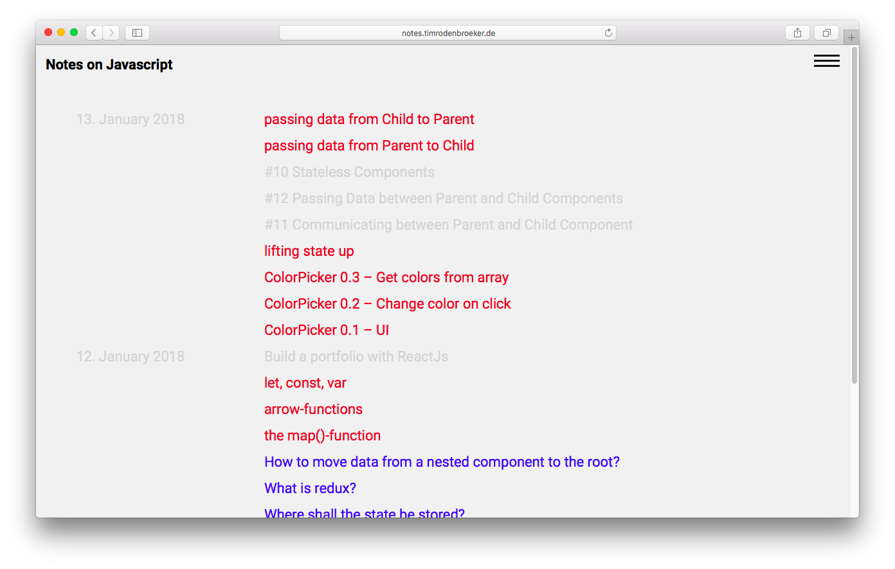
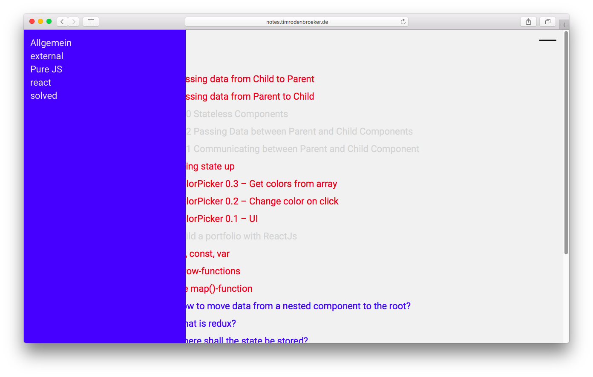
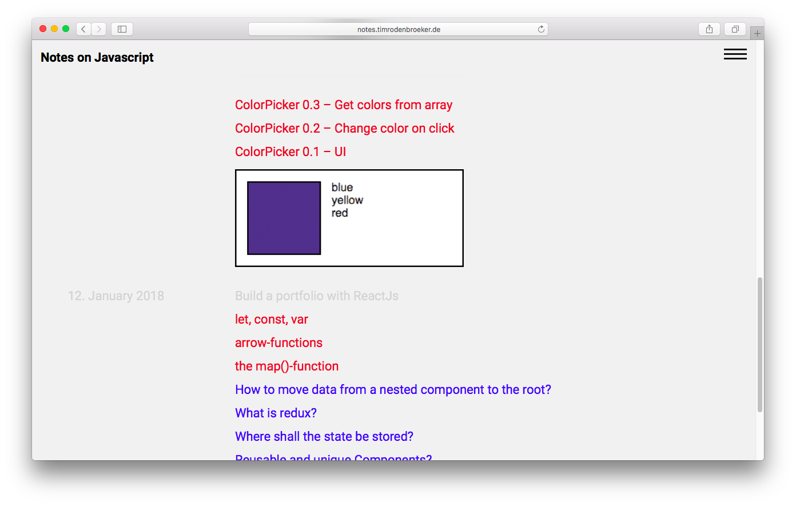
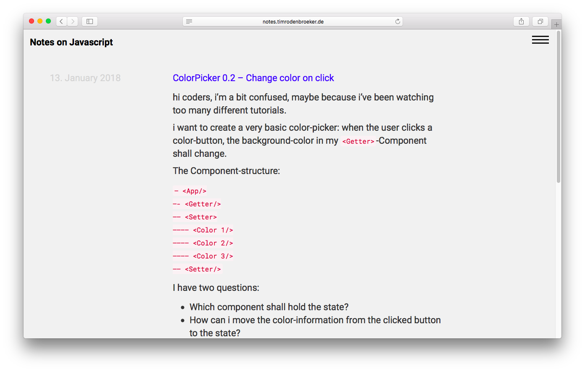
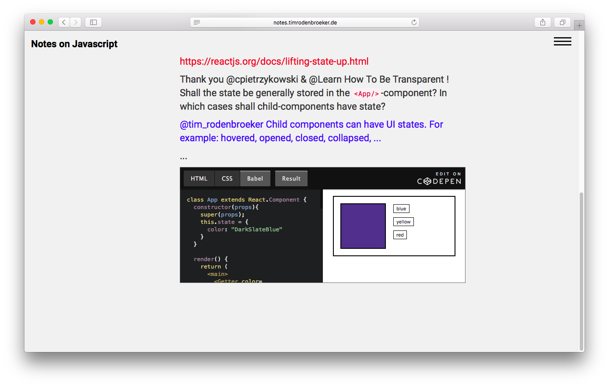

use wordpress as a notepad

A very long time ago i've started to ask myself where i should store all the notes that i make while studying web technologies. I've tried evernote, quiver, bear, plain markdown and many more ways that all had their heavy disadvantages.

Well, i have to admit that I have some tricky requirements: I want to be able to write HTML to format text, embed codepen, gist pastebin etc and i need to tag all my notes. Later on i will need a search function and a category archive.

I think i've found a very good solution for my problem: Wordpress! I've developed a custom theme that has all the features mentioned above. It is dead simple.

